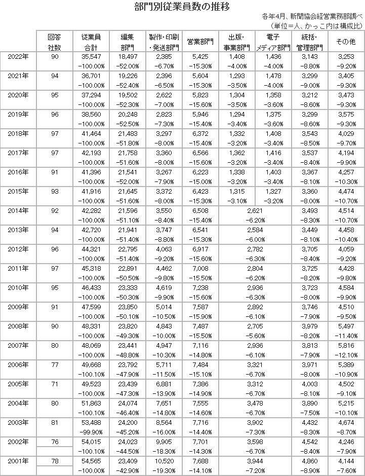

## 一般社団法人 日本新聞協会
https://www.pressnet.or.jp/about/
### 日本新聞協会について
日本新聞協会は、全国の新聞社・通信社・放送局が倫理の向上を目指す自主的な組織として、戦後間もない1946年7月23日に創立されました。事務局を東京都千代田区内幸町に置いています。また、神奈川県横浜市中区日本大通の「横浜情報文化センター」内で、ニュースパーク(日本新聞博物館)を運営しています。

会員社の代表者で組織する総会、理事会の元に、各種委員会を置いて活動しています。主な活動内容は以下のとおりです。

#### 新聞の発行部数と世帯数の推移

#### 日刊紙の都道府県別発行部数と普及度

#### 新聞広告費、新聞広告量の推移

#### 新聞社の総売上高の推移

#### 新聞用紙の生産と消費

#### 新聞・通信社従業員総数

